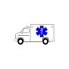
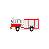
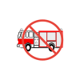
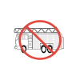
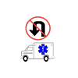
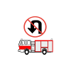
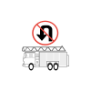
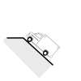

# Emergency Access Hazards 
### Click on the icons below to access the symbols 
<a href='https://minhaskamal.github.io/DownGit/#/home?url=https://github.com/NAPSG/DHS-Symbol-Server/tree/main/dhs-symbol/assets/icons/Access%20Hazards/Emergency%20Access%20Hazards'>Download this folder by clicking here</a>  Hazard Access Apparatus Ambulance  Hazard Access Apparatus Fire Engine  Hazard Access Apparatus No Fire Engine  Hazard Access Blocked No Access  Hazard Access Blocked Road  Hazard Access Bridge Do Not Cross  Hazard Access Clearance Low Height No Access Fire Engine  Hazard Access Clearance Low Height No Access  Hazard Access Clearance Low Height  Hazard Access Clearance Narrow No Access Fire Engine  Hazard Access Clearance Narrow No Access  Hazard Access Clearance Narrow  Hazard Access No Ladder Truck or Semi Truck Access  Hazard Access No Turnaround Ambulance  Hazard Access No Turnaround Fire Engine  Hazard Access No Turnaround Ladder Truck or Semi Truck  Hazard Access No Turnaround Vehicle General  Hazard Access No Turnaround  Hazard Access No Vehicle Access  Hazard Access No Vertical Ladder Access  Hazard Access Poor Access Vehicle General  Hazard Access Restricted Weight  Hazard Access Road Access Vehicle General  Hazard Access Steep Access Difficult  Hazard Access Steep Access Easy  Hazard Access Steep Access Extreme  Hazard Access Steep Access General  Hazard Access Freeway Turnaround  Hazard Access Road Turnaround  Tournaround  Hazard Steep Access Moderate  Hazard Steep Access Vehicle  Hazard Access Traffic Circle  Hazard Access Aerial  Hazard Traffic Calming  Hazard No Aerial Access  Hazard No Aerial Access 
