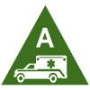
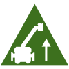
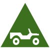
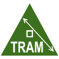
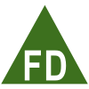
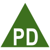
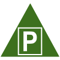

# Emergency Access Points 
### Click on the icons below to access the symbols 
<a href='https://minhaskamal.github.io/DownGit/#/home?url=https://github.com/NAPSG/DHS-Symbol-Server/tree/main/dhs-symbol/assets/icons/Access%20Hazards/Emergency%20Access%20Points'>Download this folder by clicking here</a> 
 Ambulance Access  Ladder Truck Access  Pumper Access  Small Vehicle Access  Tram or Vertical Lift  Water Access  Fire Department Access  Police Department Access  Public Works Access  Trail Access  Vehicle Parking 
