# Hazard Points Detailed 
### Click on the icons below to access the symbols 
<a href='https://minhaskamal.github.io/DownGit/#/home?url=https://github.com/NAPSG/DHS-Symbol-Server/tree/main/dhs-symbol/assets/icons/Hazard/Hazard%20Points%20Detailed'>Download this folder by clicking here</a>  Bowstring Truss <a href='https://github.com/NAPSG/DHS-Symbol-Server/raw/main/dhs-symbol/assets/icons/Hazard/Hazard%20Points%20Detailed/icon-MAAD.svg'>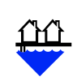</a> Building Over or Next to Water <a href='https://github.com/NAPSG/DHS-Symbol-Server/raw/main/dhs-symbol/assets/icons/Hazard/Hazard%20Points%20Detailed/icon-MAAE.svg'>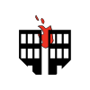</a> Close Exposure  Collapse Likely  Common Attic <a href='https://github.com/NAPSG/DHS-Symbol-Server/raw/main/dhs-symbol/assets/icons/Hazard/Hazard%20Points%20Detailed/icon-MAAH.svg'>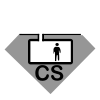</a> Confined Space  DO NOT ENTER Building  DO NOT USE Water  Electrical Hazards  Evacuation Hazards  Fall Hazards  General Hazards <a href='https://github.com/NAPSG/DHS-Symbol-Server/raw/main/dhs-symbol/assets/icons/Hazard/Hazard%20Points%20Detailed/icon-MAAO.svg'>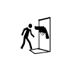</a> Hazardous Entry Violent <a href='https://github.com/NAPSG/DHS-Symbol-Server/raw/main/dhs-symbol/assets/icons/Hazard/Hazard%20Points%20Detailed/icon-MAAP.svg'>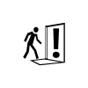</a> Hazardous Entry  Hazardous Shaft <a href='https://github.com/NAPSG/DHS-Symbol-Server/raw/main/dhs-symbol/assets/icons/Hazard/Hazard%20Points%20Detailed/icon-MAAR.svg'>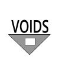</a> Hazardous Voids <a href='https://github.com/NAPSG/DHS-Symbol-Server/raw/main/dhs-symbol/assets/icons/Hazard/Hazard%20Points%20Detailed/icon-MAAS.svg'>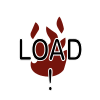</a> High Fire Load  High Occupancy Load <a href='https://github.com/NAPSG/DHS-Symbol-Server/raw/main/dhs-symbol/assets/icons/Hazard/Hazard%20Points%20Detailed/icon-MAAU.svg'>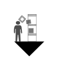</a> High Pile Storage  Lightweight Floor  Lightweight Roof  Magnetic Hazards  ManTrap or Entrapment  No Roof Operations  No Water Supply  Not Occupied or Abandoned  Poison <a href='https://github.com/NAPSG/DHS-Symbol-Server/raw/main/dhs-symbol/assets/icons/Hazard/Hazard%20Points%20Detailed/icon-MABD.svg'>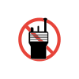</a> Poor or No Radio Reception  Powerline Above  Radioactive <a href='https://github.com/NAPSG/DHS-Symbol-Server/raw/main/dhs-symbol/assets/icons/Hazard/Hazard%20Points%20Detailed/icon-MABG.svg'>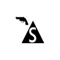</a> Safety Zone, Gun Cover  Slip Hazards  Soft Soil  Truss, General  Truss, Metal  Truss, Wood I Beam  Truss, Wood  HazMat Tank, Horizontal <a href='https://github.com/NAPSG/DHS-Symbol-Server/raw/main/dhs-symbol/assets/icons/Hazard/Hazard%20Points%20Detailed/icon-MABO.svg'>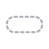</a> HazMat Tank, Underground  HazMat Tank, Vertical 
