# Hazardous Materials 
### Click on the icons below to access the symbols 
<a href='https://minhaskamal.github.io/DownGit/#/home?url=https://github.com/NAPSG/DHS-Symbol-Server/tree/main/dhs-symbol/assets/icons/Hazardous%20Materials/Hazardous%20Materials'>Download this folder by clicking here</a> <a href='https://github.com/NAPSG/DHS-Symbol-Server/raw/main/dhs-symbol/assets/icons/Hazardous%20Materials/Hazardous%20Materials/icon-JAAA.svg'>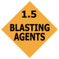</a> HazMat DOT Placarding, Class 1 Blasting Agent 1.5 <a href='https://github.com/NAPSG/DHS-Symbol-Server/raw/main/dhs-symbol/assets/icons/Hazardous%20Materials/Hazardous%20Materials/icon-JAAB.svg'>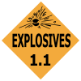</a> HazMat DOT Placarding, Class 1 Explosives 1.1 <a href='https://github.com/NAPSG/DHS-Symbol-Server/raw/main/dhs-symbol/assets/icons/Hazardous%20Materials/Hazardous%20Materials/icon-JAAC.svg'>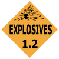</a> HazMat DOT Placarding, Class 1 Explosives 1.2 <a href='https://github.com/NAPSG/DHS-Symbol-Server/raw/main/dhs-symbol/assets/icons/Hazardous%20Materials/Hazardous%20Materials/icon-JAAD.svg'>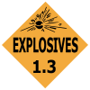</a> HazMat DOT Placarding, Class 1 Explosives 1.3 <a href='https://github.com/NAPSG/DHS-Symbol-Server/raw/main/dhs-symbol/assets/icons/Hazardous%20Materials/Hazardous%20Materials/icon-JAAE.svg'>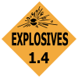</a> HazMat DOT Placarding, Class 1 Explosives 1.4 <a href='https://github.com/NAPSG/DHS-Symbol-Server/raw/main/dhs-symbol/assets/icons/Hazardous%20Materials/Hazardous%20Materials/icon-JAAF.svg'>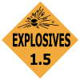</a> HazMat DOT Placarding, Class 1 Explosives 1.5 <a href='https://github.com/NAPSG/DHS-Symbol-Server/raw/main/dhs-symbol/assets/icons/Hazardous%20Materials/Hazardous%20Materials/icon-JAAG.svg'>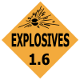</a> HazMat DOT Placarding, Class 1 Explosives 1.6  HazMat DOT Placarding, Class 1 Explosives  HazMat DOT Placarding, Class 2 Chlorine <a href='https://github.com/NAPSG/DHS-Symbol-Server/raw/main/dhs-symbol/assets/icons/Hazardous%20Materials/Hazardous%20Materials/icon-JAAJ.svg'>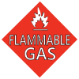</a> HazMat DOT Placarding, Class 2 Flammable Gas 2.1 <a href='https://github.com/NAPSG/DHS-Symbol-Server/raw/main/dhs-symbol/assets/icons/Hazardous%20Materials/Hazardous%20Materials/icon-JAAK.svg'>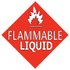</a> HazMat DOT Placarding, Class 2 Flammable Liquid <a href='https://github.com/NAPSG/DHS-Symbol-Server/raw/main/dhs-symbol/assets/icons/Hazardous%20Materials/Hazardous%20Materials/icon-JAAL.svg'>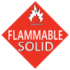</a> HazMat DOT Placarding, Class 2 Flammable Solid  HazMat DOT Placarding, Class 2 Inhalation Hazards 2.3 <a href='https://github.com/NAPSG/DHS-Symbol-Server/raw/main/dhs-symbol/assets/icons/Hazardous%20Materials/Hazardous%20Materials/icon-JAAN.svg'>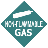</a> HazMat DOT Placarding, Class 2 Non Flammable Gas 2.2 <a href='https://github.com/NAPSG/DHS-Symbol-Server/raw/main/dhs-symbol/assets/icons/Hazardous%20Materials/Hazardous%20Materials/icon-JAAO.svg'>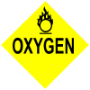</a> HazMat DOT Placarding, Class 2 Oxygen 2.2 <a href='https://github.com/NAPSG/DHS-Symbol-Server/raw/main/dhs-symbol/assets/icons/Hazardous%20Materials/Hazardous%20Materials/icon-JAAP.svg'>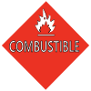</a> HazMat DOT Placarding, Class 3 Combustible <a href='https://github.com/NAPSG/DHS-Symbol-Server/raw/main/dhs-symbol/assets/icons/Hazardous%20Materials/Hazardous%20Materials/icon-JAAQ.svg'>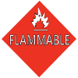</a> HazMat DOT Placarding, Class 3 Flammable <a href='https://github.com/NAPSG/DHS-Symbol-Server/raw/main/dhs-symbol/assets/icons/Hazardous%20Materials/Hazardous%20Materials/icon-JAAR.svg'>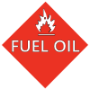</a> HazMat DOT Placarding, Class 3 Fuel Oil <a href='https://github.com/NAPSG/DHS-Symbol-Server/raw/main/dhs-symbol/assets/icons/Hazardous%20Materials/Hazardous%20Materials/icon-JAAS.svg'>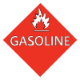</a> HazMat DOT Placarding, Class 3 Gasoline <a href='https://github.com/NAPSG/DHS-Symbol-Server/raw/main/dhs-symbol/assets/icons/Hazardous%20Materials/Hazardous%20Materials/icon-JAAT.svg'>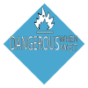</a> HazMat DOT Placarding, Class 4 Dangerous When Wet <a href='https://github.com/NAPSG/DHS-Symbol-Server/raw/main/dhs-symbol/assets/icons/Hazardous%20Materials/Hazardous%20Materials/icon-JAAU.svg'>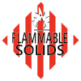</a> HazMat DOT Placarding, Class 4 Flammable Solids <a href='https://github.com/NAPSG/DHS-Symbol-Server/raw/main/dhs-symbol/assets/icons/Hazardous%20Materials/Hazardous%20Materials/icon-JAAV.svg'>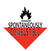</a> HazMat DOT Placarding, Class 4 Spontaneously Combustible <a href='https://github.com/NAPSG/DHS-Symbol-Server/raw/main/dhs-symbol/assets/icons/Hazardous%20Materials/Hazardous%20Materials/icon-JAAW.svg'>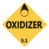</a> HazMat DOT Placarding, Class 5 Organic Peroxides 5.1  HazMat DOT Placarding, Class 5 Organic Peroxides 5.2  HazMat DOT Placarding, Class 6 Infectious  HazMat DOT Placarding, Class 6 Inhalation Hazards  HazMat DOT Placarding, Class 6 Poison Gas  HazMat DOT Placarding, Class 6 Poisons  HazMat DOT Placarding, Class 6 Toxic Gas  HazMat DOT Placarding, Class 6 Toxic <a href='https://github.com/NAPSG/DHS-Symbol-Server/raw/main/dhs-symbol/assets/icons/Hazardous%20Materials/Hazardous%20Materials/icon-JABE.svg'>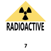</a> HazMat DOT Placarding, Class 7 Radioactive  HazMat DOT Placarding, Class 8 Acids  HazMat DOT Placarding, Class 8 Alkaline <a href='https://github.com/NAPSG/DHS-Symbol-Server/raw/main/dhs-symbol/assets/icons/Hazardous%20Materials/Hazardous%20Materials/icon-JABH.svg'>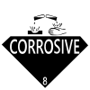</a> HazMat DOT Placarding, Class 8 Corrosive  HazMat DOT Placarding, Class 9 <a href='https://github.com/NAPSG/DHS-Symbol-Server/raw/main/dhs-symbol/assets/icons/Hazardous%20Materials/Hazardous%20Materials/icon-JABJ.svg'>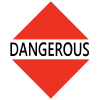</a> HazMat DOT Placarding, Class Other, DANGEROUS  HazMat DOT Placarding, Class Other, HOT  HazMat DOT Placarding, Class Other Store Away From Food  Hazmat General, Option 1 <a href='https://github.com/NAPSG/DHS-Symbol-Server/raw/main/dhs-symbol/assets/icons/Hazardous%20Materials/Hazardous%20Materials/icon-JABN.svg'>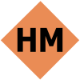</a> Hazmat General, Option 2  Hazmat General, Option 3 <a href='https://github.com/NAPSG/DHS-Symbol-Server/raw/main/dhs-symbol/assets/icons/Hazardous%20Materials/Hazardous%20Materials/icon-JABP.svg'>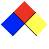</a> NFPA 704 
