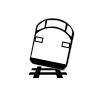

# Human Caused Hazards 
### Click on the icons below to access the symbols 
<a href='https://minhaskamal.github.io/DownGit/#/home?url=https://github.com/NAPSG/DHS-Symbol-Server/tree/main/dhs-symbol/assets/icons/Human%20Caused%20Hazards/Human%20Caused%20Hazards'>Download this folder by clicking here</a>  Explosion Hazard  Fire Commercial Hazard  Fire Forest Hazard  Fire House Hazard  Fire Industrial Hazard  Fire Other Hazard  Fire School Hazard  HazMat Release Hazard  Other Hazard  Plane Crash  Radiological General Hazard  Radiological Nuclear Power Hazard  Structural Collapse Hazard  Train Derailment 
