# Incident Resources 
### Click on the icons below to access the symbols 
<a href='https://minhaskamal.github.io/DownGit/#/home?url=https://github.com/NAPSG/DHS-Symbol-Server/tree/main/dhs-symbol/assets/icons/Incident/Incident%20Resources'>Download this folder by clicking here</a> <a href='https://github.com/NAPSG/DHS-Symbol-Server/raw/main/dhs-symbol/assets/icons/Incident/Incident%20Resources/icon-HBAA.svg'>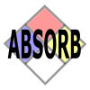</a> HazMat Features, Absorption <a href='https://github.com/NAPSG/DHS-Symbol-Server/raw/main/dhs-symbol/assets/icons/Incident/Incident%20Resources/icon-HBAB.svg'>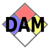</a> HazMat Features, Dam <a href='https://github.com/NAPSG/DHS-Symbol-Server/raw/main/dhs-symbol/assets/icons/Incident/Incident%20Resources/icon-HBAC.svg'>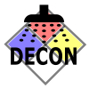</a> HazMat Features, Decontamination <a href='https://github.com/NAPSG/DHS-Symbol-Server/raw/main/dhs-symbol/assets/icons/Incident/Incident%20Resources/icon-HBAD.svg'>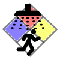</a> HazMat Features, Decontamination, Ambulatory <a href='https://github.com/NAPSG/DHS-Symbol-Server/raw/main/dhs-symbol/assets/icons/Incident/Incident%20Resources/icon-HBAE.svg'>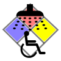</a> HazMat Features, Decontamination, Non-Ambulatory <a href='https://github.com/NAPSG/DHS-Symbol-Server/raw/main/dhs-symbol/assets/icons/Incident/Incident%20Resources/icon-HBAF.svg'>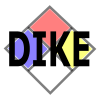</a> HazMat Features, Dike <a href='https://github.com/NAPSG/DHS-Symbol-Server/raw/main/dhs-symbol/assets/icons/Incident/Incident%20Resources/icon-HBAG.svg'>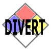</a> HazMat Features, Diversion <a href='https://github.com/NAPSG/DHS-Symbol-Server/raw/main/dhs-symbol/assets/icons/Incident/Incident%20Resources/icon-HBAH.svg'>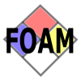</a> HazMat Features, Foam  Area Command Post  Command Post Plain  Command Post  Emergency Operations Center  Incident Command Post  Joint Operations Center  Multi Agency Coordination Center  Base  Base, NWCG  Camp  Camp, NWCG  Barrier, Emergency Access Only  Barrier  Barrier, With Security  Barrier, with Checkpoint  Bomb, Containment  Bomb, Detonation Location  Civilian Staging, Not Specific  Civilian Staging, Animal Reunification  Civilian Staging, Family Reunification  Civilian Staging, Transit  Civilian Staging, Volunteer  EMS, Plain  Responder First Aid  EMS, Casualty Collection Point  EMS, Treatment Plain  Medical Supply Cache  EMS, Triage <a href='https://github.com/NAPSG/DHS-Symbol-Server/raw/main/dhs-symbol/assets/icons/Incident/Incident%20Resources/icon-HBBK.svg'>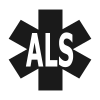</a> EMS, ALS <a href='https://github.com/NAPSG/DHS-Symbol-Server/raw/main/dhs-symbol/assets/icons/Incident/Incident%20Resources/icon-HBBL.svg'>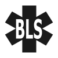</a> EMS, BLS  EMS, ILS  EMS, Treatment Plain  Landing Zone, Helibase  Landing Zone, Marine Dock  Landing Zone, Marine Launch Site  Marine Landing Zone  Public Information  Public Information Media  Staging  Staging, NWCG  Staging, Air  Staging, Critical Incident Stress Management  Staging, EMS  Staging, Equipment  Staging, Faith  Staging, Fire  Staging, Law Enforcement  Staging, Priority 1  Staging, Priority 2  Staging, Rehab  Supply Distribution Center  SWAT  SWAT, Rehearsal Area  SWAT, Sniper Location  SWAT, Standoff Location  SWAT, Canine <a href='https://github.com/NAPSG/DHS-Symbol-Server/raw/main/dhs-symbol/assets/icons/Incident/Incident%20Resources/icon-HBCM.svg'>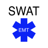</a> SWAT, EMT  SWAT, Hostage Negotation  SWAT Rally Point  Water, Fire Hydrant  Water Point, Helicopter  Water Point, Retardent  Water Point, Vehicle  Water Point, General 
