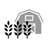

# Agriculture 
### Click on the icons below to access the symbols 
<a href='https://minhaskamal.github.io/DownGit/#/home?url=https://github.com/NAPSG/DHS-Symbol-Server/tree/main/dhs-symbol/assets/icons/Infrastructure/Agriculture'>Download this folder by clicking here</a>  Animal Aquaculture Facilities  Animal Slaughtering and Processing Facilities  Beef Cattle Ranches and Farms  Botanical and Zoological Gardens  Cattle Feedlots  Dairy Cattle Farms  Fruit and Tree Nut Farms  Greenhouse Nursery and Floriculture Production Facilities  Hog and Pig Farms  Hunting Trapping and Game Propagation Facilities  Oilseed and Grain Farms  Other Crop Farms  Poultry and Egg Production Farms  Poultry Slaughtering and Processing Facilities  State Fairgrounds  Vegetable and Melon Farms 
