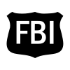
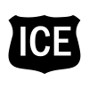

# Law Enforcement 
### Click on the icons below to access the symbols 
<a href='https://minhaskamal.github.io/DownGit/#/home?url=https://github.com/NAPSG/DHS-Symbol-Server/tree/main/dhs-symbol/assets/icons/Infrastructure/Law%20Enforcement'>Download this folder by clicking here</a>  Bureau of Alcohol Tobacco and Firearms  Department of Interior (DOI) Bureau of Indian Affairs (BIA) Law Enforcement Facilities  Department of Interior (DOI) Bureau of Land Management (BLM) Law Enforcement Facilities  Department of Interior (DOI) Bureau of Reclamation (BOR) Law Enforcement Facilities  Department of Interior (DOI) Fish and Wildlife Service (FWS) Law Enforcement Facilities  Department of Interior (DOI) National Park Service (NPS) Law Enforcement Facilities  Department of Interior (DOI) US-Park Police (USPP) Law Enforcement Facilities  Drug Enforcement Agency  Federal Bureau of Investigaton (FBI) Offices  Department of Homeland Security (DHS) Immigration and Customs Enforcement (ICE) Facilities  US Customs and Border Protection (CBP) Office of Field Operations OFO Container Security Initiative CSI Locations  US Customs and Border Protection (CBP) Office of Field Operations OFO Facilities  US Customs and Border Protection (CBP) Office of Field Operations OFO Sector Headquarters  US Customs and Border Protection (CBP) US Border Patrol USBP Stations  Law Enforcement Locations  US Marshal Service  US Postal Service (USPS) Postal Inspection Service Facilities  Law, Generic 
