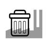

# Water Supply 
### Click on the icons below to access the symbols 
<a href='https://minhaskamal.github.io/DownGit/#/home?url=https://github.com/NAPSG/DHS-Symbol-Server/tree/main/dhs-symbol/assets/icons/Infrastructure/Water%20Supply'>Download this folder by clicking here</a>  Air Water Solid Waste Management Plants  Drinking Water Source  Drinking Water Source, Federal Government  Drinking Water Source, Local Government  Drinking Water Source, Native American  Drinking Water Source, Private  Drinking Water Source, Public Private  Drinking Water Source, State Government  Drinking Water Storage  Environmental Protection Agency (EPA) Facility Registry Service (FRS) Wastewater Treatment Plants  Water System Community Water System, Drinking Water Treatment Plants  Water System Non Transient non community system, Drinking Water Treatment Plants 
