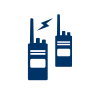

# Communications Lifeline 
### Click on the icons below to access the symbols 
<a href='https://minhaskamal.github.io/DownGit/#/home?url=https://github.com/NAPSG/DHS-Symbol-Server/tree/main/dhs-symbol/assets/icons/Lifelines/Communications_Lifeline'>Download this folder by clicking here</a>  Communications  Communications  Communications: 911 and Dispatch  Communications: 911 and Dispatch  Communications: Alerts, Warnings, and Messages  Communications: Alerts, Warnings, and Messages  Communications: Financial Services  Communications: Financial Services  Communications: Infrastructure  Communications: Infrastructure  Communications: Responder Communications  Communications: Responder Communications 
