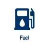

# Energy Lifeline 
### Click on the icons below to access the symbols 
<a href='https://minhaskamal.github.io/DownGit/#/home?url=https://github.com/NAPSG/DHS-Symbol-Server/tree/main/dhs-symbol/assets/icons/Lifelines/Energy%20Lifeline'>Download this folder by clicking here</a>  Energy  Energy  Energy: Fuel  Energy: Fuel  Energy: Power  Energy: Power 
