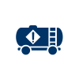

# Hazardous Material Lifeline 
### Click on the icons below to access the symbols 
<a href='https://minhaskamal.github.io/DownGit/#/home?url=https://github.com/NAPSG/DHS-Symbol-Server/tree/main/dhs-symbol/assets/icons/Lifelines/Hazardous%20Material%20Lifeline'>Download this folder by clicking here</a>  Hazardous Material  Hazardous Material  Hazardous Material: Facilities  Hazardous Material: Facilities  Hazardous Material: HazMat, Pollutants, Contaminants  Hazardous Material: HazMat, Pollutants, Contaminants 
