# Alarm and Detectors 
### Click on the icons below to access the symbols 
<a href='https://minhaskamal.github.io/DownGit/#/home?url=https://github.com/NAPSG/DHS-Symbol-Server/tree/main/dhs-symbol/assets/icons/Preplan/Alarm%20and%20Detectors'>Download this folder by clicking here</a> <a href='https://github.com/NAPSG/DHS-Symbol-Server/raw/main/dhs-symbol/assets/icons/Preplan/Alarm%20and%20Detectors/icon-CCAA.svg'>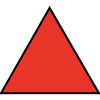</a> Alarm <a href='https://github.com/NAPSG/DHS-Symbol-Server/raw/main/dhs-symbol/assets/icons/Preplan/Alarm%20and%20Detectors/icon-CCAB.svg'>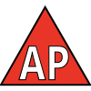</a> Alarm Communications, Annunciator Panel <a href='https://github.com/NAPSG/DHS-Symbol-Server/raw/main/dhs-symbol/assets/icons/Preplan/Alarm%20and%20Detectors/icon-CCAC.svg'>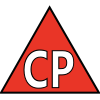</a> Alarm Control Panel <a href='https://github.com/NAPSG/DHS-Symbol-Server/raw/main/dhs-symbol/assets/icons/Preplan/Alarm%20and%20Detectors/icon-CCAD.svg'>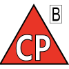</a> Alarm Control Panel, Burglar Alarm <a href='https://github.com/NAPSG/DHS-Symbol-Server/raw/main/dhs-symbol/assets/icons/Preplan/Alarm%20and%20Detectors/icon-CCAE.svg'>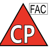</a> Alarm Control Panel, FAC <a href='https://github.com/NAPSG/DHS-Symbol-Server/raw/main/dhs-symbol/assets/icons/Preplan/Alarm%20and%20Detectors/icon-CCAF.svg'>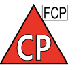</a> Alarm Control Panel, Fire Alarm Control Panel <a href='https://github.com/NAPSG/DHS-Symbol-Server/raw/main/dhs-symbol/assets/icons/Preplan/Alarm%20and%20Detectors/icon-CCAG.svg'>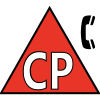</a> Alarm Control Panel, Switchboard Panel <a href='https://github.com/NAPSG/DHS-Symbol-Server/raw/main/dhs-symbol/assets/icons/Preplan/Alarm%20and%20Detectors/icon-CCAH.svg'>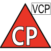</a> Alarm Control Panel, Voice Control Panel <a href='https://github.com/NAPSG/DHS-Symbol-Server/raw/main/dhs-symbol/assets/icons/Preplan/Alarm%20and%20Detectors/icon-CCAI.svg'>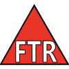</a> FTR <a href='https://github.com/NAPSG/DHS-Symbol-Server/raw/main/dhs-symbol/assets/icons/Preplan/Alarm%20and%20Detectors/icon-CCAJ.svg'>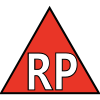</a> Reset Panel  Smoke Panel  Voice Control Panel  Detector Frame <a href='https://github.com/NAPSG/DHS-Symbol-Server/raw/main/dhs-symbol/assets/icons/Preplan/Alarm%20and%20Detectors/icon-CCAN.svg'>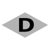</a> Detector  Duct Detector  Duct Detector, Flame  Duct Detector, Flow  Duct Detector, Gas  Duct Detector, Heat  Duct Detector, Level <a href='https://github.com/NAPSG/DHS-Symbol-Server/raw/main/dhs-symbol/assets/icons/Preplan/Alarm%20and%20Detectors/icon-CCAU.svg'>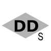</a> Duct Detector, Smoke  Gas Detector Pressure <a href='https://github.com/NAPSG/DHS-Symbol-Server/raw/main/dhs-symbol/assets/icons/Preplan/Alarm%20and%20Detectors/icon-CCAW.svg'>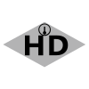</a> Heat Detector  Smoke Detector  Smoke Detector, Beam  Smoke Detector, Flow Switch  Smoke Detector, Ionization  Smoke Detector, Photoelectric  Smoke Detector, Tamper Detector  Smoke Detector, Tamper Switch  Smoke Detector  Gas Detector  Heat Detector, Fixed Temp  Heat Detector, Rate Compensate  Heat Detector, Rate Fixed  Heat Detector, Rate of Rise  Heat Detector 
