# Feature Shutoff 
### Click on the icons below to access the symbols 
<a href='https://minhaskamal.github.io/DownGit/#/home?url=https://github.com/NAPSG/DHS-Symbol-Server/tree/main/dhs-symbol/assets/icons/Preplan/Feature%20Shutoff'>Download this folder by clicking here</a> <a href='https://github.com/NAPSG/DHS-Symbol-Server/raw/main/dhs-symbol/assets/icons/Preplan/Feature%20Shutoff/icon-CDAA.svg'>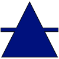</a> Plain <a href='https://github.com/NAPSG/DHS-Symbol-Server/raw/main/dhs-symbol/assets/icons/Preplan/Feature%20Shutoff/icon-CDAB.svg'>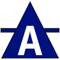</a> Air Handling  CNG <a href='https://github.com/NAPSG/DHS-Symbol-Server/raw/main/dhs-symbol/assets/icons/Preplan/Feature%20Shutoff/icon-CDAD.svg'>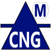</a> CNG (Compressed Natural Gas), Main <a href='https://github.com/NAPSG/DHS-Symbol-Server/raw/main/dhs-symbol/assets/icons/Preplan/Feature%20Shutoff/icon-CDAE.svg'>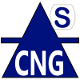</a> CNG (Compressed Natural Gas), Sub <a href='https://github.com/NAPSG/DHS-Symbol-Server/raw/main/dhs-symbol/assets/icons/Preplan/Feature%20Shutoff/icon-CDAF.svg'>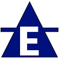</a> Electrical  Electrical, Main <a href='https://github.com/NAPSG/DHS-Symbol-Server/raw/main/dhs-symbol/assets/icons/Preplan/Feature%20Shutoff/icon-CDAH.svg'>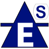</a> Electrical, Sub  Fuel  Fuel, Main <a href='https://github.com/NAPSG/DHS-Symbol-Server/raw/main/dhs-symbol/assets/icons/Preplan/Feature%20Shutoff/icon-CDAK.svg'>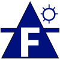</a> Fuel Pipeline <a href='https://github.com/NAPSG/DHS-Symbol-Server/raw/main/dhs-symbol/assets/icons/Preplan/Feature%20Shutoff/icon-CDAL.svg'>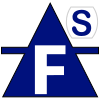</a> Fuel, Sub  Gas  Gas, Main <a href='https://github.com/NAPSG/DHS-Symbol-Server/raw/main/dhs-symbol/assets/icons/Preplan/Feature%20Shutoff/icon-CDAO.svg'>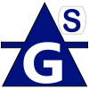</a> Gas, Sub <a href='https://github.com/NAPSG/DHS-Symbol-Server/raw/main/dhs-symbol/assets/icons/Preplan/Feature%20Shutoff/icon-CDAP.svg'>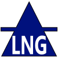</a> LNG <a href='https://github.com/NAPSG/DHS-Symbol-Server/raw/main/dhs-symbol/assets/icons/Preplan/Feature%20Shutoff/icon-CDAQ.svg'>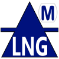</a> LNG, Main <a href='https://github.com/NAPSG/DHS-Symbol-Server/raw/main/dhs-symbol/assets/icons/Preplan/Feature%20Shutoff/icon-CDAR.svg'>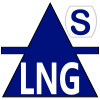</a> LNG, Sub (Propane) <a href='https://github.com/NAPSG/DHS-Symbol-Server/raw/main/dhs-symbol/assets/icons/Preplan/Feature%20Shutoff/icon-CDAS.svg'>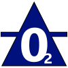</a> Oxygen  Product Shutoff <a href='https://github.com/NAPSG/DHS-Symbol-Server/raw/main/dhs-symbol/assets/icons/Preplan/Feature%20Shutoff/icon-CDAU.svg'>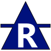</a> Refrigeration  Refrigeration, Main <a href='https://github.com/NAPSG/DHS-Symbol-Server/raw/main/dhs-symbol/assets/icons/Preplan/Feature%20Shutoff/icon-CDAW.svg'>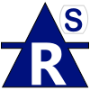</a> Refrigeration, Sub  Solar Panel <a href='https://github.com/NAPSG/DHS-Symbol-Server/raw/main/dhs-symbol/assets/icons/Preplan/Feature%20Shutoff/icon-CDAY.svg'>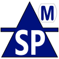</a> Solar Panel, Main  Solar Panel, Sub <a href='https://github.com/NAPSG/DHS-Symbol-Server/raw/main/dhs-symbol/assets/icons/Preplan/Feature%20Shutoff/icon-CDBA.svg'>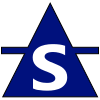</a> Steam <a href='https://github.com/NAPSG/DHS-Symbol-Server/raw/main/dhs-symbol/assets/icons/Preplan/Feature%20Shutoff/icon-CDBB.svg'>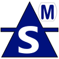</a> Steam, Main <a href='https://github.com/NAPSG/DHS-Symbol-Server/raw/main/dhs-symbol/assets/icons/Preplan/Feature%20Shutoff/icon-CDBC.svg'>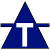</a> Telecommunications <a href='https://github.com/NAPSG/DHS-Symbol-Server/raw/main/dhs-symbol/assets/icons/Preplan/Feature%20Shutoff/icon-CDBD.svg'>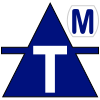</a> Telecommunications MAIN <a href='https://github.com/NAPSG/DHS-Symbol-Server/raw/main/dhs-symbol/assets/icons/Preplan/Feature%20Shutoff/icon-CDBE.svg'>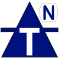</a> Telecommunications Network <a href='https://github.com/NAPSG/DHS-Symbol-Server/raw/main/dhs-symbol/assets/icons/Preplan/Feature%20Shutoff/icon-CDBF.svg'>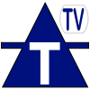</a> Telecommunications TV <a href='https://github.com/NAPSG/DHS-Symbol-Server/raw/main/dhs-symbol/assets/icons/Preplan/Feature%20Shutoff/icon-CDBG.svg'>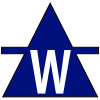</a> Water Shutoff <a href='https://github.com/NAPSG/DHS-Symbol-Server/raw/main/dhs-symbol/assets/icons/Preplan/Feature%20Shutoff/icon-CDBH.svg'>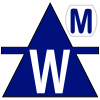</a> Water Shutoff, Main <a href='https://github.com/NAPSG/DHS-Symbol-Server/raw/main/dhs-symbol/assets/icons/Preplan/Feature%20Shutoff/icon-CDBI.svg'>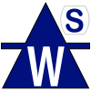</a> Water Shutoff, Sub 
