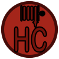
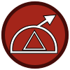
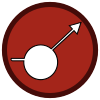
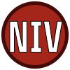
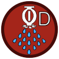
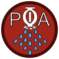
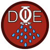
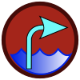
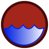

# Fire Suppression 
### Click on the icons below to access the symbols 
<a href='https://minhaskamal.github.io/DownGit/#/home?url=https://github.com/NAPSG/DHS-Symbol-Server/tree/main/dhs-symbol/assets/icons/Preplan/Fire%20Suppression'>Download this folder by clicking here</a>  Fire Department Connection, Combination Sprinkler Standpipe  Fire Department Connection, FDC1  Fire Department Connection, FDC2  Fire Department Connection, Sprinkler Connection  Fire Department Connection, Standpipe Connection  Fire Hose Connection, Hose Connection  Fire Hose Connection, Hose Connection Wet  Fire Pump, With Drive  Fire Pump, without Drive  Hose Connection, Dry  Hose Reel, CO2  Hose Reel, Dry Chemical  Hose Reel, Dry  Hose Reel, Foam  Hose Reel, Wet  Monitor, Charged  Monitor, Dry  Riser Dry  Riser Wet  Sprinkler Control Valve, Non Indicating Valve  Sprinkler Control Valve, Outside Screw and Yoke  Sprinkler Control Valve, Post Indicating Valve  Sprinkler Control Valve, Wall Post Indicating Valve  Sprinkler Control Valve, Zone Valve  Sprinkler System, Dry  Sprinkler System, PreAction  Sprinkler System, Semi Automatic  Sprinkler System, Sprinkler Deluge  Water Source, Drafting Site  Water Source, Dry Hydrant  Water Source, Hydrant Fire  Water Source, Static  Water Source, Water Inlet  Fire Pump  Sprinkler Control Valve  Sprinkler System, Sprinkler General 
