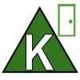
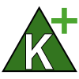
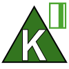
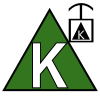
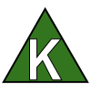
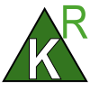

# Key or Knox Box 
### Click on the icons below to access the symbols 
<a href='https://minhaskamal.github.io/DownGit/#/home?url=https://github.com/NAPSG/DHS-Symbol-Server/tree/main/dhs-symbol/assets/icons/Preplan/Key%20or%20Knox%20Box'>Download this folder by clicking here</a>  Knox or Key Box, Door Entry  Knox or Key Box, Drug Vault  Knox or Key Box, Keycard  Knox or Key Box, Key Shunt  Knox or Key Box, Plain  Knox or Key Box, Residential 
