Preplan Features Click on the icons below to access the symbols <a href='https://minhaskamal.github.io/DownGit/#/home?url=https://github.com/NAPSG/DHS-Symbol-Server/tree/main/dhs-symbol/assets/icons/Preplan/Preplan%20Features'>Download this folder by clicking here</a>  Addressable Location, Functional area <a href='https://github.com/NAPSG/DHS-Symbol-Server/raw/main/dhs-symbol/assets/icons/Preplan/Preplan%20Features/icon-CAAB.svg'>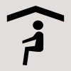</a> Addressable Location, Living Space <a href='https://github.com/NAPSG/DHS-Symbol-Server/raw/main/dhs-symbol/assets/icons/Preplan/Preplan%20Features/icon-CAAC.svg'>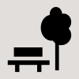</a> Addressable Location, Outdoor Space  Addressable Location, Parking <a href='https://github.com/NAPSG/DHS-Symbol-Server/raw/main/dhs-symbol/assets/icons/Preplan/Preplan%20Features/icon-CAAE.svg'>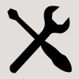</a> Addressable Location, Repair Build <a href='https://github.com/NAPSG/DHS-Symbol-Server/raw/main/dhs-symbol/assets/icons/Preplan/Preplan%20Features/icon-CAAF.svg'>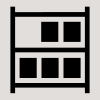</a> Addressable Location, Storage  Addressable Location, Utility  Addressable Location, Work Space  Business, Bank  Business, Grocery  Business, Retail  Business <a href='https://github.com/NAPSG/DHS-Symbol-Server/raw/main/dhs-symbol/assets/icons/Preplan/Preplan%20Features/icon-CAAM.svg'>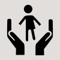</a> Childcare, Child <a href='https://github.com/NAPSG/DHS-Symbol-Server/raw/main/dhs-symbol/assets/icons/Preplan/Preplan%20Features/icon-CAAN.svg'>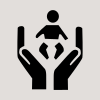</a> Childcare, Infant  Electrical Room  Electrical, Transformer  Electrical, Vault <a href='https://github.com/NAPSG/DHS-Symbol-Server/raw/main/dhs-symbol/assets/icons/Preplan/Preplan%20Features/icon-CAAR.svg'>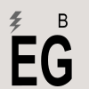</a> Electrical Generator, Battery <a href='https://github.com/NAPSG/DHS-Symbol-Server/raw/main/dhs-symbol/assets/icons/Preplan/Preplan%20Features/icon-CAAS.svg'>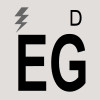</a> Electrical Generator, Diesel <a href='https://github.com/NAPSG/DHS-Symbol-Server/raw/main/dhs-symbol/assets/icons/Preplan/Preplan%20Features/icon-CAAT.svg'>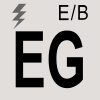</a> Electrical Generator, Electrical Battery <a href='https://github.com/NAPSG/DHS-Symbol-Server/raw/main/dhs-symbol/assets/icons/Preplan/Preplan%20Features/icon-CAAU.svg'>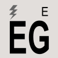</a> Electrical Generator, Electrical  Electrical, Powerlines <a href='https://github.com/NAPSG/DHS-Symbol-Server/raw/main/dhs-symbol/assets/icons/Preplan/Preplan%20Features/icon-CAAW.svg'>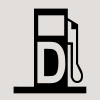</a> Fuel Pump, Diesel <a href='https://github.com/NAPSG/DHS-Symbol-Server/raw/main/dhs-symbol/assets/icons/Preplan/Preplan%20Features/icon-CAAX.svg'>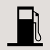</a> Fuel Pump, Regular <a href='https://github.com/NAPSG/DHS-Symbol-Server/raw/main/dhs-symbol/assets/icons/Preplan/Preplan%20Features/icon-CAAY.svg'>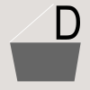</a> Garbage, Dumpster <a href='https://github.com/NAPSG/DHS-Symbol-Server/raw/main/dhs-symbol/assets/icons/Preplan/Preplan%20Features/icon-CAAZ.svg'>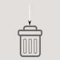</a> Garbage, Garbage Chute <a href='https://github.com/NAPSG/DHS-Symbol-Server/raw/main/dhs-symbol/assets/icons/Preplan/Preplan%20Features/icon-CABA.svg'>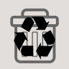</a> Garbage, Recycling <a href='https://github.com/NAPSG/DHS-Symbol-Server/raw/main/dhs-symbol/assets/icons/Preplan/Preplan%20Features/icon-CABB.svg'>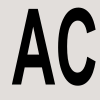</a> Location, Air Conditioning <a href='https://github.com/NAPSG/DHS-Symbol-Server/raw/main/dhs-symbol/assets/icons/Preplan/Preplan%20Features/icon-CABC.svg'>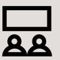</a> Location, Auditorium <a href='https://github.com/NAPSG/DHS-Symbol-Server/raw/main/dhs-symbol/assets/icons/Preplan/Preplan%20Features/icon-CABD.svg'>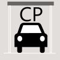</a> Location, Auto Carport <a href='https://github.com/NAPSG/DHS-Symbol-Server/raw/main/dhs-symbol/assets/icons/Preplan/Preplan%20Features/icon-CABE.svg'>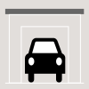</a> Location, Auto Garage  Location, Gym or Arena  Location, Institutional <a href='https://github.com/NAPSG/DHS-Symbol-Server/raw/main/dhs-symbol/assets/icons/Preplan/Preplan%20Features/icon-CABH.svg'>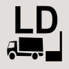</a> Location, Loading Dock <a href='https://github.com/NAPSG/DHS-Symbol-Server/raw/main/dhs-symbol/assets/icons/Preplan/Preplan%20Features/icon-CABI.svg'>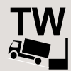</a> Location, Loading Truck Well  Location, Mercantile  Location, Parking Not  Location, Parking <a href='https://github.com/NAPSG/DHS-Symbol-Server/raw/main/dhs-symbol/assets/icons/Preplan/Preplan%20Features/icon-CABM.svg'>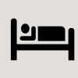</a> Location, Residential  Manual, Operations Manual  Manual, Materials Safety Data Sheet <a href='https://github.com/NAPSG/DHS-Symbol-Server/raw/main/dhs-symbol/assets/icons/Preplan/Preplan%20Features/icon-CABP.svg'>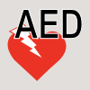</a> Medical, AED  Medical, First Aid  Medical, Nurse Station  Medical  Most Important 1  Most Important 2 <a href='https://github.com/NAPSG/DHS-Symbol-Server/raw/main/dhs-symbol/assets/icons/Preplan/Preplan%20Features/icon-CABV.svg'>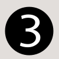</a> Most Important 3  Most Important Feature  People, Contact Information <a href='https://github.com/NAPSG/DHS-Symbol-Server/raw/main/dhs-symbol/assets/icons/Preplan/Preplan%20Features/icon-CABY.svg'>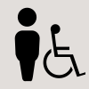</a> People, Handicapped <a href='https://github.com/NAPSG/DHS-Symbol-Server/raw/main/dhs-symbol/assets/icons/Preplan/Preplan%20Features/icon-CABZ.svg'>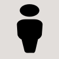</a> People, Occupant  Restrooms, Men <a href='https://github.com/NAPSG/DHS-Symbol-Server/raw/main/dhs-symbol/assets/icons/Preplan/Preplan%20Features/icon-CACB.svg'>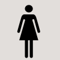</a> Restrooms, Women  Room, Boiler Room <a href='https://github.com/NAPSG/DHS-Symbol-Server/raw/main/dhs-symbol/assets/icons/Preplan/Preplan%20Features/icon-CACD.svg'>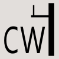</a> Room, Catwalk  Room, Classroom <a href='https://github.com/NAPSG/DHS-Symbol-Server/raw/main/dhs-symbol/assets/icons/Preplan/Preplan%20Features/icon-CACF.svg'>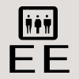</a> Room, Elevator Room  Room, Guard Shack  Room, Kitchen <a href='https://github.com/NAPSG/DHS-Symbol-Server/raw/main/dhs-symbol/assets/icons/Preplan/Preplan%20Features/icon-CACI.svg'>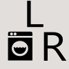</a> Room, Laundry Room  Room, Library  Room, Main Entry <a href='https://github.com/NAPSG/DHS-Symbol-Server/raw/main/dhs-symbol/assets/icons/Preplan/Preplan%20Features/icon-CACL.svg'>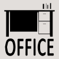</a> Room, Office  Room, Storage  Room, Telephone Equipment Room  Room, Telephone Equipment <a href='https://github.com/NAPSG/DHS-Symbol-Server/raw/main/dhs-symbol/assets/icons/Preplan/Preplan%20Features/icon-CACP.svg'>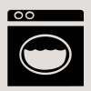</a> Room, Utility Room  Safety, Decontamination Shower  Safety, Eyewash  Safety, Handwash <a href='https://github.com/NAPSG/DHS-Symbol-Server/raw/main/dhs-symbol/assets/icons/Preplan/Preplan%20Features/icon-CACT.svg'>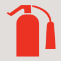</a> Safety Location, Fire Extinguisher <a href='https://github.com/NAPSG/DHS-Symbol-Server/raw/main/dhs-symbol/assets/icons/Preplan/Preplan%20Features/icon-CACU.svg'>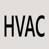</a> Safety Location, HVAC  Security, Area of Refuge 2  Security, Area of Refuge <a href='https://github.com/NAPSG/DHS-Symbol-Server/raw/main/dhs-symbol/assets/icons/Preplan/Preplan%20Features/icon-CACX.svg'>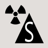</a> Security, Bomb Shelter  Security, Evacuation Shelter  Security, Guard <a href='https://github.com/NAPSG/DHS-Symbol-Server/raw/main/dhs-symbol/assets/icons/Preplan/Preplan%20Features/icon-CADA.svg'>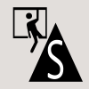</a> Security, Safe Room <a href='https://github.com/NAPSG/DHS-Symbol-Server/raw/main/dhs-symbol/assets/icons/Preplan/Preplan%20Features/icon-CADB.svg'>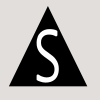</a> Security, Safe Zone <a href='https://github.com/NAPSG/DHS-Symbol-Server/raw/main/dhs-symbol/assets/icons/Preplan/Preplan%20Features/icon-CADC.svg'>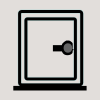</a> Security, Safe <a href='https://github.com/NAPSG/DHS-Symbol-Server/raw/main/dhs-symbol/assets/icons/Preplan/Preplan%20Features/icon-CADD.svg'>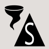</a> Security, Storm Shelter <a href='https://github.com/NAPSG/DHS-Symbol-Server/raw/main/dhs-symbol/assets/icons/Preplan/Preplan%20Features/icon-CADE.svg'>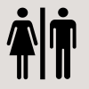</a> Restrooms  Blank  Electrical Generator  Emergency Control Station  Fire Pump <a href='https://github.com/NAPSG/DHS-Symbol-Server/raw/main/dhs-symbol/assets/icons/Preplan/Preplan%20Features/icon-CADJ.svg'>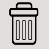</a> Garbage  Manual  Room, Catwalk  Room, Kitchen  Room, Laundry Room  Room, Main Entry 
