# Public Alert and Warnings 
### Click on the icons below to access the symbols 
<a href='https://minhaskamal.github.io/DownGit/#/home?url=https://github.com/NAPSG/DHS-Symbol-Server/tree/main/dhs-symbol/assets/icons/Public%20Alert/Public%20Alert%20and%20Warnings'>Download this folder by clicking here</a> <a href='https://github.com/NAPSG/DHS-Symbol-Server/raw/main/dhs-symbol/assets/icons/Public%20Alert/Public%20Alert%20and%20Warnings/icon-GAAA.svg'>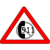</a> 911 Telephone Outage Emergency <a href='https://github.com/NAPSG/DHS-Symbol-Server/raw/main/dhs-symbol/assets/icons/Public%20Alert/Public%20Alert%20and%20Warnings/icon-GAAB.svg'>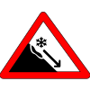</a> Avalanche Warning <a href='https://github.com/NAPSG/DHS-Symbol-Server/raw/main/dhs-symbol/assets/icons/Public%20Alert/Public%20Alert%20and%20Warnings/icon-GAAC.svg'>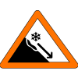</a> Avalanche Watch <a href='https://github.com/NAPSG/DHS-Symbol-Server/raw/main/dhs-symbol/assets/icons/Public%20Alert/Public%20Alert%20and%20Warnings/icon-GAAD.svg'>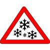</a> Blizzard Warning <a href='https://github.com/NAPSG/DHS-Symbol-Server/raw/main/dhs-symbol/assets/icons/Public%20Alert/Public%20Alert%20and%20Warnings/icon-GAAE.svg'>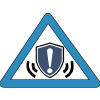</a> Blue Alert <a href='https://github.com/NAPSG/DHS-Symbol-Server/raw/main/dhs-symbol/assets/icons/Public%20Alert/Public%20Alert%20and%20Warnings/icon-GAAF.svg'>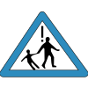</a> Child Abduction Emergency <a href='https://github.com/NAPSG/DHS-Symbol-Server/raw/main/dhs-symbol/assets/icons/Public%20Alert/Public%20Alert%20and%20Warnings/icon-GAAG.svg'>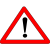</a> Civil Danger Warning  Civil Emergency Message  Coastal Flood Warning <a href='https://github.com/NAPSG/DHS-Symbol-Server/raw/main/dhs-symbol/assets/icons/Public%20Alert/Public%20Alert%20and%20Warnings/icon-GAAJ.svg'>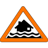</a> Coastal Flood Watch <a href='https://github.com/NAPSG/DHS-Symbol-Server/raw/main/dhs-symbol/assets/icons/Public%20Alert/Public%20Alert%20and%20Warnings/icon-GAAK.svg'>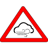</a> Dust Storm Warning <a href='https://github.com/NAPSG/DHS-Symbol-Server/raw/main/dhs-symbol/assets/icons/Public%20Alert/Public%20Alert%20and%20Warnings/icon-GAAL.svg'>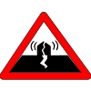</a> Earthquake Warning  Emergency Action Notification National <a href='https://github.com/NAPSG/DHS-Symbol-Server/raw/main/dhs-symbol/assets/icons/Public%20Alert/Public%20Alert%20and%20Warnings/icon-GAAN.svg'>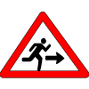</a> Evacuation Immediate  Extreme Wind Warning <a href='https://github.com/NAPSG/DHS-Symbol-Server/raw/main/dhs-symbol/assets/icons/Public%20Alert/Public%20Alert%20and%20Warnings/icon-GAAP.svg'>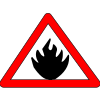</a> Fire Warning <a href='https://github.com/NAPSG/DHS-Symbol-Server/raw/main/dhs-symbol/assets/icons/Public%20Alert/Public%20Alert%20and%20Warnings/icon-GAAQ.svg'>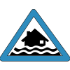</a> Flash Flood Statement <a href='https://github.com/NAPSG/DHS-Symbol-Server/raw/main/dhs-symbol/assets/icons/Public%20Alert/Public%20Alert%20and%20Warnings/icon-GAAR.svg'>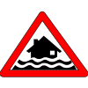</a> Flash Flood Warning  Flash Flood Watch  Flood Statement  Flood Warning  Flood Watch <a href='https://github.com/NAPSG/DHS-Symbol-Server/raw/main/dhs-symbol/assets/icons/Public%20Alert/Public%20Alert%20and%20Warnings/icon-GAAW.svg'>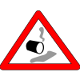</a> Hazardous Materials Warning <a href='https://github.com/NAPSG/DHS-Symbol-Server/raw/main/dhs-symbol/assets/icons/Public%20Alert/Public%20Alert%20and%20Warnings/icon-GAAX.svg'>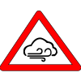</a> High Wind Warning <a href='https://github.com/NAPSG/DHS-Symbol-Server/raw/main/dhs-symbol/assets/icons/Public%20Alert/Public%20Alert%20and%20Warnings/icon-GAAY.svg'>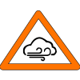</a> High Wind Watch <a href='https://github.com/NAPSG/DHS-Symbol-Server/raw/main/dhs-symbol/assets/icons/Public%20Alert/Public%20Alert%20and%20Warnings/icon-GAAZ.svg'>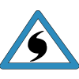</a> Hurricane Statement <a href='https://github.com/NAPSG/DHS-Symbol-Server/raw/main/dhs-symbol/assets/icons/Public%20Alert/Public%20Alert%20and%20Warnings/icon-GABA.svg'>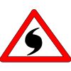</a> Hurricane Warning <a href='https://github.com/NAPSG/DHS-Symbol-Server/raw/main/dhs-symbol/assets/icons/Public%20Alert/Public%20Alert%20and%20Warnings/icon-GABB.svg'>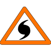</a> Hurricane Watch <a href='https://github.com/NAPSG/DHS-Symbol-Server/raw/main/dhs-symbol/assets/icons/Public%20Alert/Public%20Alert%20and%20Warnings/icon-GABC.svg'>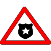</a> Law Enforcement Warning  Local Area Emergency  Nuclear Power Plant Warning <a href='https://github.com/NAPSG/DHS-Symbol-Server/raw/main/dhs-symbol/assets/icons/Public%20Alert/Public%20Alert%20and%20Warnings/icon-GABF.svg'>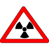</a> Radiological Hazard Warning <a href='https://github.com/NAPSG/DHS-Symbol-Server/raw/main/dhs-symbol/assets/icons/Public%20Alert/Public%20Alert%20and%20Warnings/icon-GABG.svg'>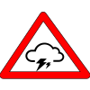</a> Severe Thunderstorm Warning <a href='https://github.com/NAPSG/DHS-Symbol-Server/raw/main/dhs-symbol/assets/icons/Public%20Alert/Public%20Alert%20and%20Warnings/icon-GABH.svg'>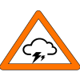</a> Severe Thunderstorm Watch <a href='https://github.com/NAPSG/DHS-Symbol-Server/raw/main/dhs-symbol/assets/icons/Public%20Alert/Public%20Alert%20and%20Warnings/icon-GABI.svg'>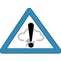</a> Severe Weather Statement <a href='https://github.com/NAPSG/DHS-Symbol-Server/raw/main/dhs-symbol/assets/icons/Public%20Alert/Public%20Alert%20and%20Warnings/icon-GABJ.svg'>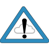</a> Special Weather Statement <a href='https://github.com/NAPSG/DHS-Symbol-Server/raw/main/dhs-symbol/assets/icons/Public%20Alert/Public%20Alert%20and%20Warnings/icon-GABK.svg'>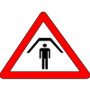</a> Shelter In Place <a href='https://github.com/NAPSG/DHS-Symbol-Server/raw/main/dhs-symbol/assets/icons/Public%20Alert/Public%20Alert%20and%20Warnings/icon-GABL.svg'>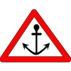</a> Special Marine Warning <a href='https://github.com/NAPSG/DHS-Symbol-Server/raw/main/dhs-symbol/assets/icons/Public%20Alert/Public%20Alert%20and%20Warnings/icon-GABM.svg'>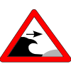</a> Storm Surge Warning <a href='https://github.com/NAPSG/DHS-Symbol-Server/raw/main/dhs-symbol/assets/icons/Public%20Alert/Public%20Alert%20and%20Warnings/icon-GABN.svg'>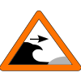</a> Storm Surge Watch <a href='https://github.com/NAPSG/DHS-Symbol-Server/raw/main/dhs-symbol/assets/icons/Public%20Alert/Public%20Alert%20and%20Warnings/icon-GABO.svg'>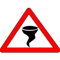</a> Tornado Warning <a href='https://github.com/NAPSG/DHS-Symbol-Server/raw/main/dhs-symbol/assets/icons/Public%20Alert/Public%20Alert%20and%20Warnings/icon-GABP.svg'>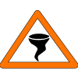</a> Tornado Watch <a href='https://github.com/NAPSG/DHS-Symbol-Server/raw/main/dhs-symbol/assets/icons/Public%20Alert/Public%20Alert%20and%20Warnings/icon-GABQ.svg'>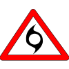</a> Tropical Storm Warning <a href='https://github.com/NAPSG/DHS-Symbol-Server/raw/main/dhs-symbol/assets/icons/Public%20Alert/Public%20Alert%20and%20Warnings/icon-GABR.svg'>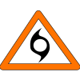</a> Tropical Storm Watch <a href='https://github.com/NAPSG/DHS-Symbol-Server/raw/main/dhs-symbol/assets/icons/Public%20Alert/Public%20Alert%20and%20Warnings/icon-GABS.svg'>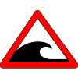</a> Tsunami Warning <a href='https://github.com/NAPSG/DHS-Symbol-Server/raw/main/dhs-symbol/assets/icons/Public%20Alert/Public%20Alert%20and%20Warnings/icon-GABT.svg'>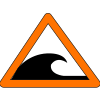</a> Tsunami Watch <a href='https://github.com/NAPSG/DHS-Symbol-Server/raw/main/dhs-symbol/assets/icons/Public%20Alert/Public%20Alert%20and%20Warnings/icon-GABU.svg'>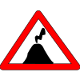</a> Volcano Warning <a href='https://github.com/NAPSG/DHS-Symbol-Server/raw/main/dhs-symbol/assets/icons/Public%20Alert/Public%20Alert%20and%20Warnings/icon-GABV.svg'>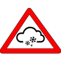</a> Winter Storm Warning <a href='https://github.com/NAPSG/DHS-Symbol-Server/raw/main/dhs-symbol/assets/icons/Public%20Alert/Public%20Alert%20and%20Warnings/icon-GABW.svg'>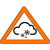</a> Winter Storm Watch 
