# Emergency Response Resources 
### Click on the icons below to access the symbols 
<a href='https://minhaskamal.github.io/DownGit/#/home?url=https://github.com/NAPSG/DHS-Symbol-Server/tree/main/dhs-symbol/assets/icons/Resources/Emergency%20Response%20Resources'>Download this folder by clicking here</a>  Type 1 Resource, Animal Health, Incident Management Team  Type 1 Resource, Animal Health, Large Animal Rescue Team  Type 1 Resource, Animal Health, Large Animal Sheltering Team  Type 1 Resource, Animal Health, Large Animal Transport Team  Type 1 Resource, Animal Health, Small Animal Rescue Team  Type 1 Resource, Animal Health, Small Animal Sheltering Team <a href='https://github.com/NAPSG/DHS-Symbol-Server/raw/main/dhs-symbol/assets/icons/Resources/Emergency%20Response%20Resources/icon-DAAG.svg'>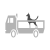</a> Type 1 Resource, Animal Health, Small Animal Transport Team  Type 2 Resource, Incident Management Team (IMT), Area Command  Type 2 Resource, Incident Management Team (IMT), Civil Air Patrol (CAP)  Type 2 Resource, Incident Management Team (IMT), Critical Incident Stress Management  Type 2 Resource, Incident Management Team (IMT), Disaster Assessment  Type 2 Resource, Incident Management Team (IMT), Evacuation Coordination Team  Type 2 Resource, Incident Management Team (IMT), Incident Management Team  Type 2 Resource, Incident Management Team (IMT), Mobile Emergency Operations Center  Type 2 Resource, Incident Management Team (IMT), Mobile Kitchen  Type 2 Resource, Incident Management Team (IMT), Volunteer Liaison Team <a href='https://github.com/NAPSG/DHS-Symbol-Server/raw/main/dhs-symbol/assets/icons/Resources/Emergency%20Response%20Resources/icon-DAAQ.svg'>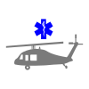</a> Type 3 Resource, Emergency Medical System (EMS) Ambulance, Air  Type 3 Resource, Emergency Medical System (EMS), Ambulance Fixed Wing Air <a href='https://github.com/NAPSG/DHS-Symbol-Server/raw/main/dhs-symbol/assets/icons/Resources/Emergency%20Response%20Resources/icon-DAAS.svg'>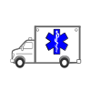</a> Type 3 Resource, Emergency Medical System (EMS), Ambulance Ground <a href='https://github.com/NAPSG/DHS-Symbol-Server/raw/main/dhs-symbol/assets/icons/Resources/Emergency%20Response%20Resources/icon-DAAT.svg'>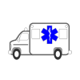</a> Type 3 Resource, Emergency Medical System (EMS), Critical Transportation Multiple Patient <a href='https://github.com/NAPSG/DHS-Symbol-Server/raw/main/dhs-symbol/assets/icons/Resources/Emergency%20Response%20Resources/icon-DAAU.svg'>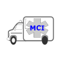</a> Type 3 Resource, Emergency Medical System (EMS), MCI Support Vehicle <a href='https://github.com/NAPSG/DHS-Symbol-Server/raw/main/dhs-symbol/assets/icons/Resources/Emergency%20Response%20Resources/icon-DAAV.svg'>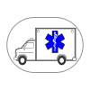</a> Type 3 Resource, Emergency Medical System (EMS), Strike Team Ambulance <a href='https://github.com/NAPSG/DHS-Symbol-Server/raw/main/dhs-symbol/assets/icons/Resources/Emergency%20Response%20Resources/icon-DAAW.svg'>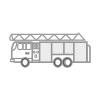</a> Type 4 Resource, Fire HazMat, Aerial Apparatus Ladder <a href='https://github.com/NAPSG/DHS-Symbol-Server/raw/main/dhs-symbol/assets/icons/Resources/Emergency%20Response%20Resources/icon-DAAX.svg'>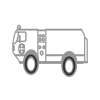</a> Type 4 Resource, Fire HazMat, ARFF <a href='https://github.com/NAPSG/DHS-Symbol-Server/raw/main/dhs-symbol/assets/icons/Resources/Emergency%20Response%20Resources/icon-DAAY.svg'>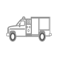</a> Type 4 Resource, Fire HazMat, Brush <a href='https://github.com/NAPSG/DHS-Symbol-Server/raw/main/dhs-symbol/assets/icons/Resources/Emergency%20Response%20Resources/icon-DAAZ.svg'>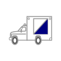</a> Type 4 Resource, Fire HazMat, Command  Type 4 Resource, Fire HazMat, Crew Transport <a href='https://github.com/NAPSG/DHS-Symbol-Server/raw/main/dhs-symbol/assets/icons/Resources/Emergency%20Response%20Resources/icon-DABB.svg'>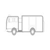</a> Type 4 Resource, Fire HazMat, Engine Pumper <a href='https://github.com/NAPSG/DHS-Symbol-Server/raw/main/dhs-symbol/assets/icons/Resources/Emergency%20Response%20Resources/icon-DABC.svg'>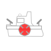</a> Type 4 Resource, Fire HazMat, Fire Boat <a href='https://github.com/NAPSG/DHS-Symbol-Server/raw/main/dhs-symbol/assets/icons/Resources/Emergency%20Response%20Resources/icon-DABD.svg'>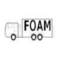</a> Type 4 Resource, Fire HazMat, Foam Tender <a href='https://github.com/NAPSG/DHS-Symbol-Server/raw/main/dhs-symbol/assets/icons/Resources/Emergency%20Response%20Resources/icon-DABE.svg'>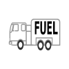</a> Type 4 Resource, Fire HazMat, Fuel Tender  Type 4 Resource, Fire HazMat, Hand Crew <a href='https://github.com/NAPSG/DHS-Symbol-Server/raw/main/dhs-symbol/assets/icons/Resources/Emergency%20Response%20Resources/icon-DABG.svg'>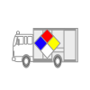</a> Type 4 Resource, Fire HazMat, HazMat <a href='https://github.com/NAPSG/DHS-Symbol-Server/raw/main/dhs-symbol/assets/icons/Resources/Emergency%20Response%20Resources/icon-DABH.svg'>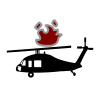</a> Type 4 Resource, Fire HazMat, Helicopter  Type 4 Resource, Fire HazMat, Helitanker <a href='https://github.com/NAPSG/DHS-Symbol-Server/raw/main/dhs-symbol/assets/icons/Resources/Emergency%20Response%20Resources/icon-DABJ.svg'>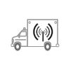</a> Type 4 Resource, Fire HazMat, Mobile Communication Unit <a href='https://github.com/NAPSG/DHS-Symbol-Server/raw/main/dhs-symbol/assets/icons/Resources/Emergency%20Response%20Resources/icon-DABK.svg'>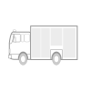</a> Type 4 Resource, Fire HazMat, Rescue <a href='https://github.com/NAPSG/DHS-Symbol-Server/raw/main/dhs-symbol/assets/icons/Resources/Emergency%20Response%20Resources/icon-DABL.svg'>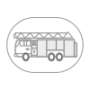</a> Type 4 Resource, Fire HazMat, Strike Team Aerial Ladder <a href='https://github.com/NAPSG/DHS-Symbol-Server/raw/main/dhs-symbol/assets/icons/Resources/Emergency%20Response%20Resources/icon-DABM.svg'>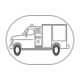</a> Type 4 Resource, Fire HazMat, Strike Team Brush Truck <a href='https://github.com/NAPSG/DHS-Symbol-Server/raw/main/dhs-symbol/assets/icons/Resources/Emergency%20Response%20Resources/icon-DABN.svg'>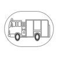</a> Type 4 Resource, Fire HazMat, Strike Team Engine  Type 4 Resource, Fire HazMat, Strike Team US Coast Guard <a href='https://github.com/NAPSG/DHS-Symbol-Server/raw/main/dhs-symbol/assets/icons/Resources/Emergency%20Response%20Resources/icon-DABP.svg'>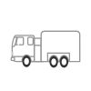</a> Type 4 Resource, Fire HazMat, Water Tender Tanker <a href='https://github.com/NAPSG/DHS-Symbol-Server/raw/main/dhs-symbol/assets/icons/Resources/Emergency%20Response%20Resources/icon-DABQ.svg'>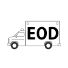</a> Type 6 Resource, Law Enforcement, Bomb Squad  Type 6 Resource, Law Enforcement, Fixed Wing Recon  Type 6 Resource, Law Enforcement, Helicopter <a href='https://github.com/NAPSG/DHS-Symbol-Server/raw/main/dhs-symbol/assets/icons/Resources/Emergency%20Response%20Resources/icon-DABT.svg'>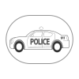</a> Type 6 Resource, Law Enforcement, Law Enforcement Patrol Strike Team <a href='https://github.com/NAPSG/DHS-Symbol-Server/raw/main/dhs-symbol/assets/icons/Resources/Emergency%20Response%20Resources/icon-DABU.svg'>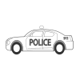</a> Type 6 Resource, Law Enforcement, Law Enforcement Patrol  Type 6 Resource, Law Enforcement, Mobile Field Force Law Enforcement Crowd Control Teams <a href='https://github.com/NAPSG/DHS-Symbol-Server/raw/main/dhs-symbol/assets/icons/Resources/Emergency%20Response%20Resources/icon-DABW.svg'>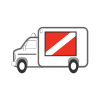</a> Type 6 Resource, Law Enforcement, Public Safety Dive Team <a href='https://github.com/NAPSG/DHS-Symbol-Server/raw/main/dhs-symbol/assets/icons/Resources/Emergency%20Response%20Resources/icon-DABX.svg'>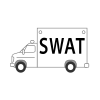</a> Type 6 Resource, Law Enforcement, SWAT  Type 7 Resource, Public Works, Bulldozer  Type 7 Resource, Public Works, Bus <a href='https://github.com/NAPSG/DHS-Symbol-Server/raw/main/dhs-symbol/assets/icons/Resources/Emergency%20Response%20Resources/icon-DACA.svg'>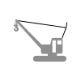</a> Type 7 Resource, Public Works, Crane Lattice  Type 7 Resource, Public Works, Damage Assessment  Type 7 Resource, Public Works, Dump Truck <a href='https://github.com/NAPSG/DHS-Symbol-Server/raw/main/dhs-symbol/assets/icons/Resources/Emergency%20Response%20Resources/icon-DACD.svg'>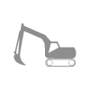</a> Type 7 Resource, Public Works, Front Excavator  Type 7 Resource, Public Works, Grader <a href='https://github.com/NAPSG/DHS-Symbol-Server/raw/main/dhs-symbol/assets/icons/Resources/Emergency%20Response%20Resources/icon-DACF.svg'>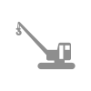</a> Type 7 Resource, Public Works, Hydraulic Crane  Type 7 Resource, Public Works, Loader Tracked <a href='https://github.com/NAPSG/DHS-Symbol-Server/raw/main/dhs-symbol/assets/icons/Resources/Emergency%20Response%20Resources/icon-DACH.svg'>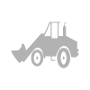</a> Type 7 Resource, Public Works, Loader  Type 7 Resource, Public Works, Road Sweeper  Type 7 Resource, Public Works, Scraper  Type 7 Resource, Public Works, Snow Blower, Front Loader  Type 7 Resource, Public Works, Snow Blower, Truck  Type 7 Resource, Public Works, Snow Cat <a href='https://github.com/NAPSG/DHS-Symbol-Server/raw/main/dhs-symbol/assets/icons/Resources/Emergency%20Response%20Resources/icon-DACN.svg'>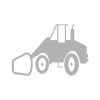</a> Type 7 Resource, Public Works, Snow Plow, Loader Mounted <a href='https://github.com/NAPSG/DHS-Symbol-Server/raw/main/dhs-symbol/assets/icons/Resources/Emergency%20Response%20Resources/icon-DACO.svg'>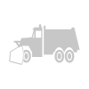</a> Type 7 Resource, Public Works, Snow Plow  Type 7 Resource, Public Works, Tug Boat  Type 7 Resource, Public Works, Wheel Loader, Backhoe  Type 8 Resource, Search and Rescue, Air Search Team (Fixed Wing)  Type 8 Resource, Search and Rescue, Airborne Reconnaissance (Fixed Wing)  Type 8 Resource, Search and Rescue, Canine Search and Rescue Team  Type 8 Resource, Search and Rescue, Cave Search and Rescue Team  Type 8 Resource, Search and Rescue, Mine and Tunnel Search and Rescue Team  Type 8 Resource, Search and Rescue, Mountain Search and Rescue Team  Type 8 Resource, Search and Rescue, Radio Direction Finding Team <a href='https://github.com/NAPSG/DHS-Symbol-Server/raw/main/dhs-symbol/assets/icons/Resources/Emergency%20Response%20Resources/icon-DACY.svg'>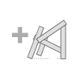</a> Type 8 Resource, Search and Rescue, Structural Collapse Rescue Team  Type 8 Resource, Search and Rescue, Swiftwater Flood Search and Rescue Team  Type 8 Resource, Search and Rescue, Urban Search and Rescue Task Force  Type 8 Resource, Search and Rescue, USAR Incident Support Team  Type 8 Resource, Search and Rescue, Wilderness Search and Rescue Team  Type 12 Resource, Public Health 
