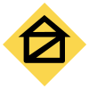
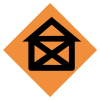
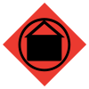

# USAR Standard Symbols 
### Click on the icons below to access the symbols 
<a href='https://minhaskamal.github.io/DownGit/#/home?url=https://github.com/NAPSG/DHS-Symbol-Server/tree/main/dhs-symbol/assets/icons/USAR/USAR%20Standard%20Symbols'>Download this folder by clicking here</a>  Structure, No Damage  Structure, Damaged  Structure, Failed  Structure, Destroyed  Victim, Detected  Victim, Confirmed  Shelter in Place  Occupant Assisted  Occupant Evacuated  Occupant Rescued  Occupant Follow-Up Form  Human Remains  Human Remains Removed  Animal Issue  Fire Incident  Flood/Water Level  Route Blocked  HazMat Incident  Helicopter Landing Zone (LZ)  Targeted Search  Extra 21  Extra 22  Extra 23  Extra 24  Other (Not Assigned to Extra) 
